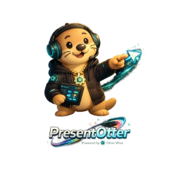

<div align="center">
  
  
  # PresentOtter 🦦
  
  **Enregistrez votre écran. Annotez en direct. Ne leaked jamais vos secrets.**
  
  [](LICENSE)
  [](https://github.com/RoYaL63/presentotter/releases)
  [](https://www.typescriptlang.org/)
  [](https://www.electronjs.org/)
  [](https://otterwise.fr)
  
  [Télécharger](#installation) · [Documentation](docs/) · [Contribuer](CONTRIBUTING.md) · [Discord](https://discord.gg/otterwise)
</div>

---

## Pourquoi PresentOtter ?

Tu crées des tutoriels Make, n8n, Airtable ou Bubble. Tu enregistres ton écran.
Et là — catastrophe — ta clé API OpenAI apparaît en clair dans la vidéo.

PresentOtter résout ça avec un **sanitizer automatique** qui détecte et masque
les credentials avant l'export. Jamais de secret dans tes vidéos.

## Features

### 🎥 Capture
- Écran entier, région personnalisée, ou fenêtre spécifique
- Audio système (loopback) + micro
- 30 ou 60 fps, résolution native ou personnalisée
- Bookmarks temporels pendant l'enregistrement

### 🖊️ Annotations en direct
- Dessin libre, rectangles, cercles, flèches
- Texte overlay positionnable
- Spotlight (focus sur une zone)
- Numéros d'étapes auto-incrémentés
- Cursor tracing : highlight, click flash, traînée

### 🔒 Sanitizer automatique
Détecte et masque automatiquement :
- Clés API (OpenAI, Anthropic, AWS, etc.)
- Tokens Bearer et JWT
- Variables d'environnement (.env)
- Numéros de carte bancaire
- Credentials n8n, Make, Airtable

### 📤 Export
- MP4 (H.264 / H.265)
- WebM (VP9)
- GIF animé
- Presets optimisés (tutorial HD, démo légère, social GIF)

## Installation

### Téléchargement direct
👉 [Dernière version](https://github.com/RoYaL63/presentotter/releases/latest)

Télécharge `PresentOtter-Setup-x.x.x.exe` et lance l'installeur.

### Build depuis les sources

Prérequis : Node.js 20+, Windows 10/11

```bash
git clone https://github.com/RoYaL63/presentotter
cd presentotter
npm install
npm run dev
```

Build production :
```bash
npm run dist:win
```

## Raccourcis clavier

| Action | Raccourci |
|---|---|
| Démarrer / Pauser | F9 |
| Stopper | F10 |
| Mode annotation | F8 |
| Clear annotations | Escape |
| Screenshot rapide | F12 |

## Contribuer

PresentOtter est open source et les contributions sont les bienvenues !
Lis [CONTRIBUTING.md](CONTRIBUTING.md) pour commencer.

## Roadmap

- [ ] v0.1 — Capture + Sanitizer + Export basique
- [ ] v0.2 — Annotations complètes + Library
- [ ] v0.3 — Webcam PiP + Audio avancé
- [ ] v1.0 — Release stable
- [ ] v2.0 — Éditeur vidéo basique + upload cloud

## Stack technique

| Composant | Technologie |
|---|---|
| App | Electron 29 + React 18 |
| Language | TypeScript strict |
| UI | Tailwind CSS + shadcn/ui |
| State | Zustand |
| Capture | Windows Graphics Capture API |
| Encodage | FFmpeg (bundlé) |
| OCR | Tesseract 5.x |
| DB locale | SQLite (better-sqlite3) |

## Licence

MIT — [voir LICENSE](LICENSE)

Fait avec 🦦 par [OTTERWISE Solutions](https://no-code-pedia-fr.lovable.app/)
